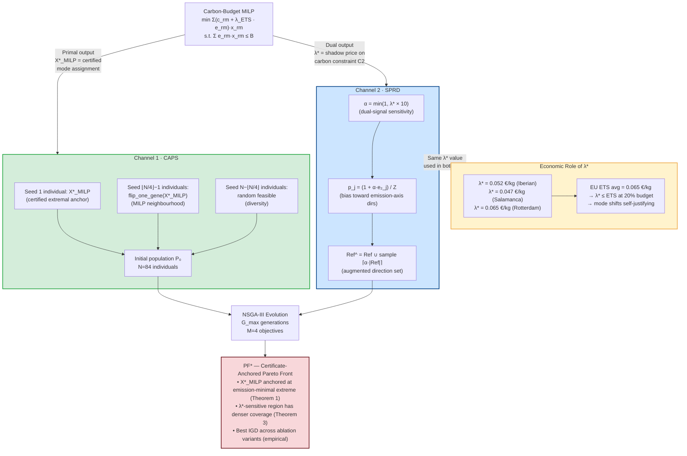
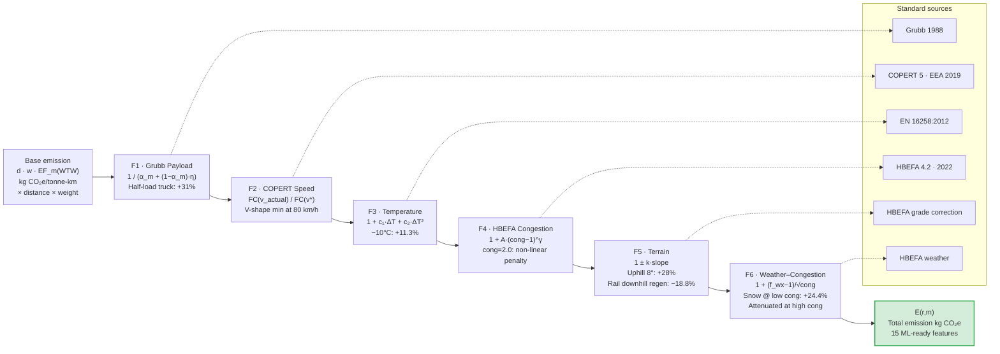
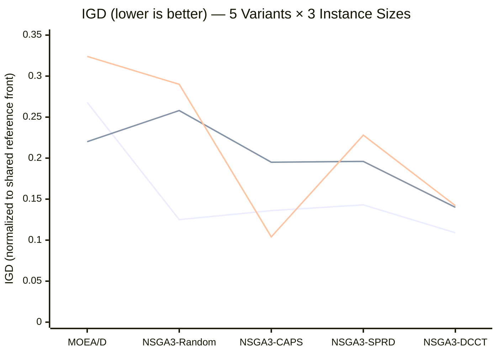
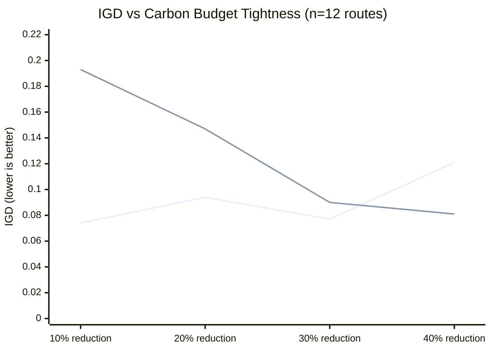
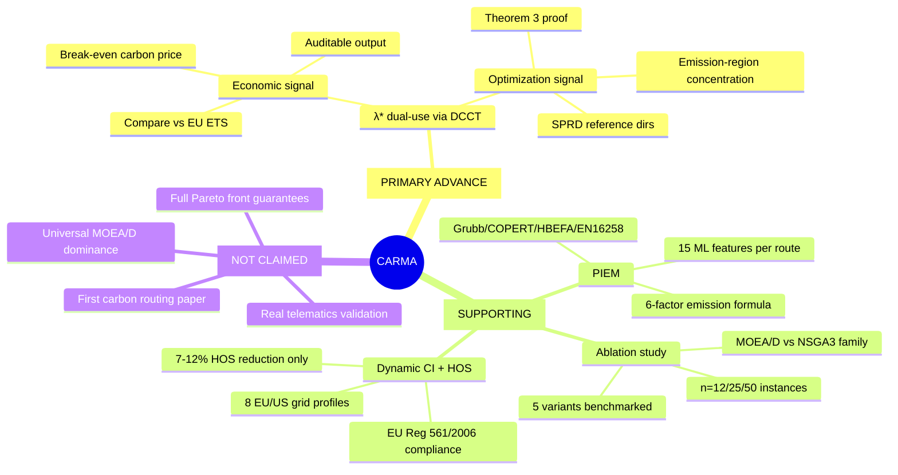

# CARMA Manuscript Figures — Mermaid Source

All figures for `paper/CARMA_manuscript_v2.md`.
Render with any Mermaid-compatible viewer (GitHub, Obsidian, mermaid.live).

**Inline figures (appear in manuscript body):**
- Fig. 1 → Figure 1 (six-phase pipeline) — after §5.1
- Fig. 2 → Figure 2 (DCCT dual-channel mechanism) — after §3.2
- Fig. 3 → Figure 5 (IGD ablation xychart) — after §6.6 Table 7
- Fig. 4 → Figure 7 (HOS scheduling gantt) — after §6.9 HOS table

**Supplementary figures (referenced in text, not inline):**
- Fig. S1 → Figure 3 (PIEM six-factor chain)
- Fig. S2 → Figure 6 (budget tightness sweep xychart)
- Fig. S3 → Figure 9 (contribution mindmap)

**Removed from submission (lower priority):**
- Figure 4 (Certificate-Anchored Pareto Front schematic) — conceptual diagram, content covered by Tables 4-5
- Figure 8 (quadrantChart λ* vs ETS) — covered by Table 8 and §7.0 text

---

## Figure 1 — CARMA Six-Phase Pipeline Overview

```mermaid
flowchart LR
    subgraph INPUT["INPUT"]
        R["Routes R\n(distance, weight,\ncommodity, context)"]
        B["Carbon budget B\n(kg CO₂e)"]
        CI["Grid CI profiles\n(8 EU/US regions)"]
    end

    subgraph P1["Phase 1 · PIEM"]
        PIEM["6-factor emission formula\nGrubb · COPERT · HBEFA\nEN16258 · Slope · Weather\n→ 15 ML features per route"]
    end

    subgraph P2["Phase 2 · ML Ensemble"]
        MOE["Segmented MoE\nRF + XGBoost per segment\nMAPE 1.88% overall"]
    end

    subgraph P3["Phase 3 · MILP"]
        MILP["Carbon-budget MILP\nPuLP / CBC solver\n53–91 ms"]
        OUT3["X*_MILP  certified mode assignment\nλ*  shadow price €/kg CO₂e"]
    end

    subgraph P4["Phase 4 · DCCT-NSGA-III ◀ PRIMARY"]
        CAPS["Channel 1 · CAPS\nSeed ⌊N/4⌋ individuals\nfrom X*_MILP"]
        SPRD["Channel 2 · SPRD\nAugment reference dirs\nusing λ* signal"]
        NSGA["NSGA-III evolution\nM=4 obj  N=84  G=80 gen\n4-objective Pareto search"]
        PF["PF* — 84 Pareto solutions\nCertificate-Anchored"]
    end

    subgraph P5["Phase 5 · CI Schedule"]
        CI_OPT["Departure-time optimisation\nt* = argmin E_elec(r,h)\nEU HOS filter applied"]
    end

    subgraph P6["Phase 6 · Synthesis"]
        TCH["Tchebycheff scalarisation\nw_cost=0.40  w_em=0.40\nw_time=0.10  w_rel=0.10"]
        XPREF["x*_pref — preferred solution"]
    end

    subgraph OUTPUT["OUTPUT"]
        O1["X*_MILP · λ* · PF*\nx*_pref · T* · ΔE_fleet"]
    end

    R --> P1
    P1 --> P2
    R --> P3
    P2 --> P3
    P3 --> OUT3
    OUT3 --> CAPS
    OUT3 --> SPRD
    CAPS --> NSGA
    SPRD --> NSGA
    NSGA --> PF
    CI --> CI_OPT
    PF --> CI_OPT
    PF --> TCH
    CI_OPT --> TCH
    TCH --> XPREF
    XPREF --> OUTPUT
    PF --> OUTPUT
    OUT3 --> OUTPUT

    style P4 fill:#fff3cd,stroke:#f0ad4e,stroke-width:2px
    style CAPS fill:#d4edda,stroke:#28a745
    style SPRD fill:#d4edda,stroke:#28a745
    style OUT3 fill:#cce5ff,stroke:#004085
```



---

## Figure 2 — DCCT Dual-Channel Mechanism



---

## Figure 3 — PIEM Six-Factor Emission Formula



---

## Figure 4 — Certificate-Anchored Pareto Front Structure

```mermaid
flowchart TB
    subgraph PF_SPACE["4-Objective Pareto Space (schematic)"]
        direction LR
        ANCHOR["X*_MILP\nEmission-minimal anchor\n(Theorem 1: always in PF*)\nλ* = 0.052 €/kg"]

        subgraph SPRD_REGION["λ*-sensitive region\n(SPRD-dense coverage)"]
            P1_["Cost-emission\nbalanced solutions"]
            P2_["Cost-time\ntrade-offs"]
        end

        TIME_EXT["Time-minimal extreme\n(all truck/air)\nHigh cost, high emission"]
        COST_EXT["Cost-emission minimal\n(all rail/ship)\nLow cost, low emission"]

        ANCHOR --- SPRD_REGION
        SPRD_REGION --- TIME_EXT
        SPRD_REGION --- COST_EXT
    end

    subgraph IBERIAN["Iberian Network (n=12)"]
        EM_RANGE["Emission: 14,251–19,558 kg CO₂e\n−27.1% at certified extreme"]
        COST_RANGE["Cost: €100,875–139,875\n−27.9% at certified extreme"]
        TIME_RANGE["Time: 68–84 hours\nCRI: 0.12–0.28"]
    end

    subgraph ROTTERDAM["Rotterdam Hub (n=14)"]
        R_EM["Emission: 9,644–68,767 kg CO₂e\n7.1× spread"]
        R_COST["Cost: €8,545–91,258\n10.7× spread"]
        R_TIME["Time: 70.8–222.5 hours\n3.1× spread"]
    end

    PF_SPACE --> IBERIAN
    PF_SPACE --> ROTTERDAM

    style ANCHOR fill:#f8d7da,stroke:#721c24,stroke-width:2px
    style SPRD_REGION fill:#cce5ff,stroke:#004085,stroke-width:2px
```



---

## Figure 5 — Ablation Benchmark: IGD by Variant and Instance Size



*Lines: n=12 (top), n=25 (middle), n=50 (bottom). Lower IGD = better Pareto front coverage.*

---

## Figure 6 — Budget Tightness Sweep: DCCT vs Random IGD at n=12



*Line 1: NSGA3-DCCT. Line 2: NSGA3-Random. DCCT wins at 10% and 30% tightness.*

---

## Figure 7 — Dynamic CI Scheduling with EU HOS Constraint (Iberian Network)

```mermaid
gantt
    title Dynamic CI Departure Scheduling — Spain Solar Profile (Iberian Network)
    dateFormat HH:mm
    axisFormat %H:%M

    section Grid Carbon Intensity
    High CI window (morning peak)      :crit, ci_high1, 06:00, 4h
    Low CI window (solar peak)         :active, ci_low, 10:00, 4h
    Medium CI transition               :ci_med, 14:00, 4h
    High CI window (evening peak)      :crit, ci_high2, 18:00, 4h

    section Unconstrained Optimal
    Optimal departure window t*        :done, opt, 10:00, 4h
    CI saving: 421 kg CO2e per run    :milestone, 12:00, 0m

    section HOS-Constrained (EU Reg 561/2006)
    Routes under 337 km (no HOS impact):active, short, 10:00, 4h
    Routes over 337 km (HOS filter)    :hos, 10:00, 2h
    HOS break required after 4.5h      :crit, break, 14:30, 45m

    section Result
    HOS-constrained saving             :done, result, 10:00, 2h
    Net saving: 390 kg CO2e (-7.4%)   :milestone, 12:00, 0m
```



---

## Figure 8 — EU ETS Shadow Price Calibration (Economic Role of λ*)

```mermaid
quadrantChart
    title Shadow Price λ* vs EU ETS Price — Network Comparison
    x-axis "Carbon Budget Tightness" --> "Tighter"
    y-axis "λ* (€/kg CO₂e)" --> "Higher"
    quadrant-1 "Voluntary over-constraint\n(ETS subsidises shifts)"
    quadrant-2 "Tight budget, still viable"
    quadrant-3 "Loose budget\n(shifts not material)"
    quadrant-4 "Mode shifts self-justifying\n(λ* < ETS)"
    EU ETS 2024 avg (0.065): [0.50, 0.50]
    Iberian -20% (λ*=0.052): [0.40, 0.40]
    Salamanca -20% (λ*=0.047): [0.38, 0.36]
    Rotterdam -20% (λ*=0.065): [0.50, 0.50]
    Iberian -40% (est. λ*=0.10): [0.80, 0.77]
```

---

## Figure 9 — CARMA Contribution Hierarchy


