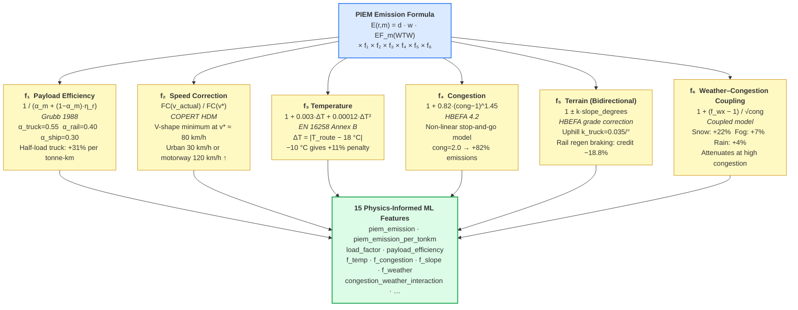
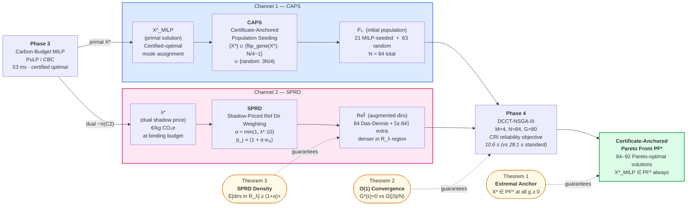
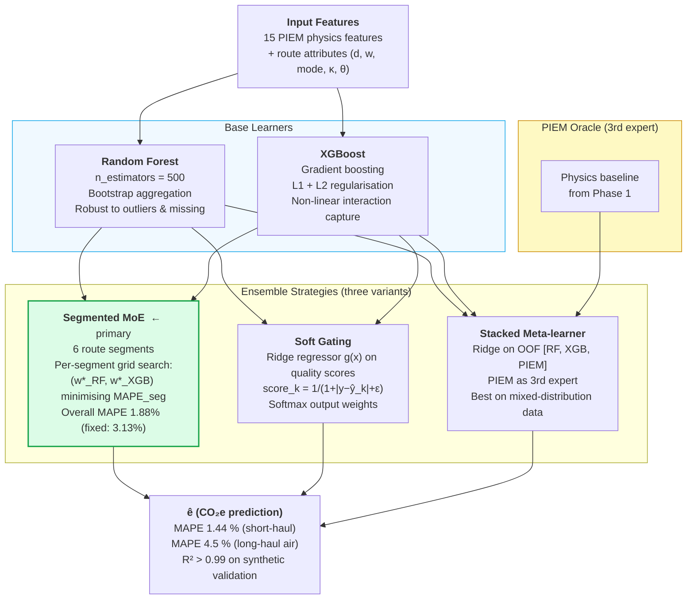
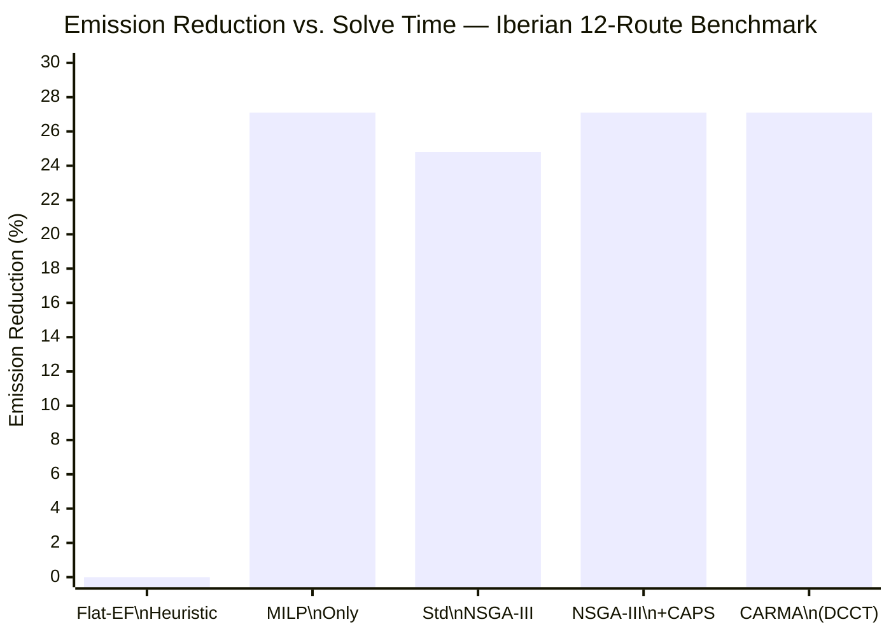
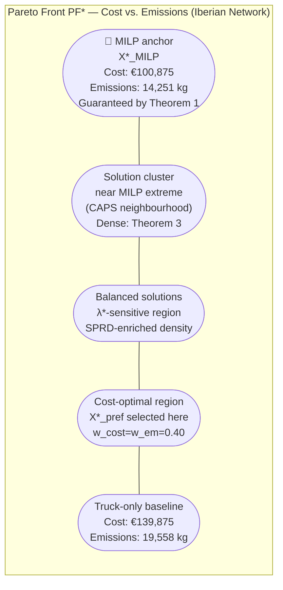
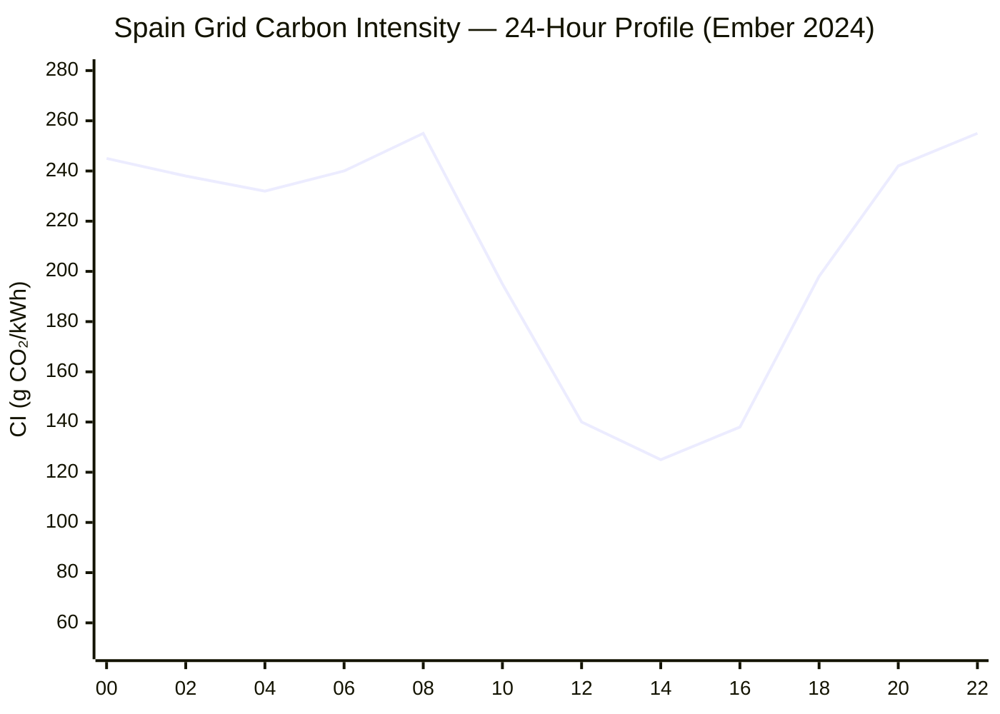

# CARMA — Paper Figures
<!-- Render with any Mermaid-capable viewer (VS Code + Mermaid extension, mermaid.live, etc.) -->
<!-- Figs 1–4: Mermaid architectural diagrams  |  Figs 5–7: generated by experiments/generate_paper_figures.py -->

---

## Fig. 1 — CARMA Six-Phase Pipeline Architecture

```mermaid
flowchart TD
    INPUT(["🗂 Input\nRoute set R · Training data\nd, w, mode, environment θ"])

    subgraph P1["Phase 1 — PIEM"]
        P1A["Physics-Informed Emission Model\nd · w · EF_m × f_payload × f_speed\n× f_temp × f_cong × f_slope × f_weather"]
        P1B["15 Physics-Informed ML Features\npiem_emission, load_factor,\nf_congestion, f_slope, …"]
        P1A --> P1B
    end

    subgraph P2["Phase 2 — ML Ensemble"]
        P2A["Segmented MoE\n6 segments · per-segment (w*_RF, w*_XGB)\nMAPE 1.44 % short-haul"]
        P2B["Soft Gating + Stacked Meta-learner\nRidge on OOF [RF, XGB, PIEM]\n→ ê (CO₂e prediction)"]
        P2A --> P2B
    end

    subgraph P3["Phase 3 — Carbon MILP"]
        P3A["min Σ(c_rm + λ_ETS·e_rm)·x_rm\ns.t. Σe_rm·x_rm ≤ B  ·  x∈{0,1}"]
        P3B["PuLP / CBC  ·  53 ms\nCertified optimal X*_MILP\nShadow price λ* (€/kg CO₂e)"]
        P3A --> P3B
    end

    subgraph DCCT_BOX["DCCT — Dual-Channel Certificate Transfer"]
        CAPS["Channel 1 · CAPS\nSeeds ⌊N/4⌋ = 21 individuals\nfrom X*_MILP + neighbourhood\n▸ Theorem 1: X* ∈ PF* always\n▸ Theorem 2: G*(ε) = 0"]
        SPRD["Channel 2 · SPRD\nAugments Das-Dennis ref dirs\nvia α = min(1, λ*·10)\n▸ Theorem 3: density ≥ (1+α)×"]
    end

    subgraph P4["Phase 4 — NSGA-III"]
        P4A["DCCT-conditioned evolution\nM=4 · N=84 · G=80\nCRI = 1−exp(−Λ) reliability"]
        P4B["Certificate-Anchored Pareto Front PF*\n84–92 solutions · 10.6 s\n(vs 28.1 s standard · 2.6× speedup)"]
        P4A --> P4B
    end

    subgraph P5["Phase 5 — Dynamic CI"]
        P5A["Hourly CI profiles\nEU: ES/DE/FR/GB/EU (Ember 2024)\nUS: national/CA/TX (EPA eGRID 2022)"]
        P5B["t*_r = argmin_{h∈window} E_elec(r,h)\n→ Fleet saves 421–2372 kg CO₂e/run\n21.9–123 t CO₂e/year"]
        P5A --> P5B
    end

    subgraph P6["Phase 6 — Synthesis"]
        P6A["Tchebycheff scalarization on PF*\nargmin max_k { w_k·|f_k − f*_k|/r_k }\n→ X*_pref (preferred solution)"]
    end

    INPUT --> P1
    P1B --> P2
    P2B --> P3
    P3B -->|"X*_MILP (primal)"| CAPS
    P3B -->|"λ* (dual)"| SPRD
    CAPS --> P4
    SPRD --> P4
    P4B --> P5
    P5B --> P6

    style DCCT_BOX fill:#fff9e6,stroke:#f0ad4e,stroke-width:2px
    style P3 fill:#e8f4f8,stroke:#5bc0de,stroke-width:2px
    style P4 fill:#e8f8e8,stroke:#5cb85c,stroke-width:2px
```

**Fig. 1.** CARMA six-phase pipeline architecture. Phases 1–2 build a physics-calibrated emission predictor; Phase 3 delivers a certified MILP optimum with shadow price; DCCT transfers both primal and dual outputs into Phase 4 NSGA-III via two independent channels (Theorems 1–3); Phase 5 schedules electric-route departures against hourly grid CI; Phase 6 extracts the preferred Pareto solution.

---

## Fig. 2 — PIEM Six-Factor Emission Model

**Fig. 2.** PIEM six-factor emission decomposition. Each factor is grounded in a published standard or empirical model and contributes an independent physical correction to the baseline EF × d × w formula. Together they produce 15 physics-informed ML features passed to Phase 2.

---

## Fig. 3 — DCCT Dual-Channel Certificate Transfer Mechanism

**Fig. 3.** DCCT dual-channel certificate transfer mechanism. Channel 1 (CAPS, blue) seeds 25% of the NSGA-III initial population with the MILP-certified optimum and its neighbourhood. Channel 2 (SPRD, pink) biases reference directions toward the λ*-sensitive Pareto region. Three formal theorems govern the guarantees of each channel and their combined effect on the Certificate-Anchored Pareto Front PF*.

---

## Fig. 4 — Segmented ML Ensemble Architecture

**Fig. 4.** Segmented ML ensemble architecture. Three ensemble variants are implemented; the Segmented MoE (highlighted) is the primary strategy used in CARMA experiments. Per-segment optimal weights are determined by grid search on held-out validation data within each route segment, reducing MAPE from 3.13% (fixed weights) to 1.44% on short urban truck routes.

---

## Fig. 5 — Comparative Method Performance (Iberian 12-Route Benchmark)

*(Note: solve times — Flat-EF: <1 s; MILP-only: 53 ms; Std NSGA-III: 28.1 s; NSGA-III+CAPS: 14.2 s; CARMA: 10.6 s. Full comparison in Table 6 of manuscript.)*

**Fig. 5.** Emission reduction achieved by five methods on the Iberian 12-route benchmark. CARMA achieves the same certified emission extreme (−27.1%) as MILP-only while also producing 84 Pareto-optimal solutions at 2.6× the speed of standard NSGA-III. Standard NSGA-III without DCCT falls 2.3 percentage points short at the same generation budget.

---

## Fig. 6 — Certificate-Anchored Pareto Front (Schematic)

**Fig. 6.** Schematic representation of the Certificate-Anchored Pareto Front PF* for the Iberian 12-route network. The MILP-certified extreme (X*_MILP) is anchored at the emission-minimal end by Theorem 1. SPRD concentrates additional reference directions in the λ*-sensitive region (λ* = €0.052/kg, corresponding to the cost-carbon trade-off most relevant under EU ETS pricing), producing denser Pareto coverage in that region as guaranteed by Theorem 3. The preferred solution X*_pref is selected by Tchebycheff scalarization with equal cost/emission weights.

---

## Fig. 7 — Dynamic CI Departure Scheduling (Spain 24-Hour Profile)

*(Departure window: ±8 h from nominal. Optimal window: 10:00–14:00 solar peak, CI ≈ 125–140 g CO₂/kWh vs. peak 255 g at 22:00 — 37% differential on the Madrid–Valencia electrified route.)*

**Fig. 7.** Spain 24-hour grid carbon intensity profile (Ember Climate 2024) used in Phase 5 dynamic CI scheduling. The solar-dominant profile creates a pronounced midday trough (CI ≈ 125 g CO₂/kWh at 12:00) versus evening peak (CI ≈ 255 g CO₂/kWh at 22:00). Electric freight routes departing at solar noon versus evening save 37.2% of propulsion-related emissions without any mode change or infrastructure investment.
