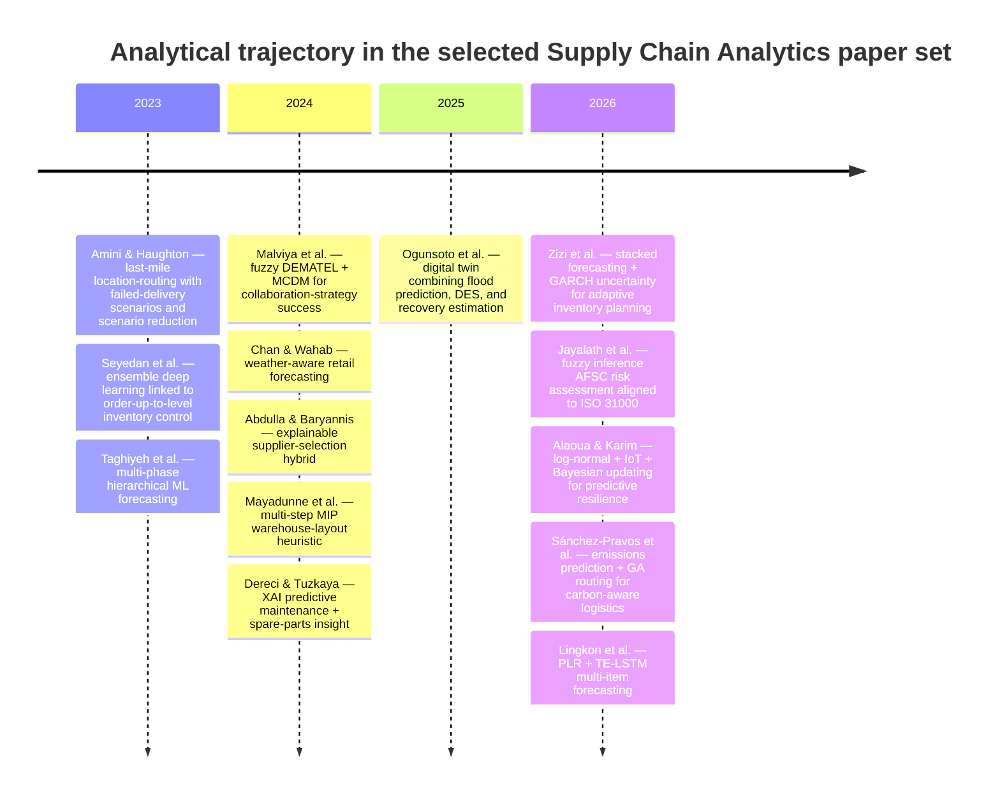
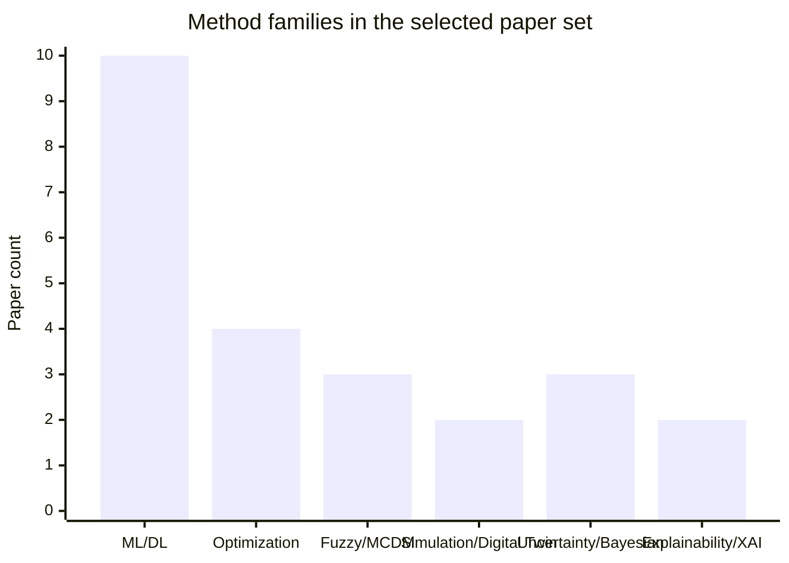

# Analytical Advancements in Supply Chain Analytics

## Executive summary

*Supply Chain Analytics* is a very young journal. DOAJ lists it as starting in 2023, and the ScienceDirect issue history shows volumes running from 2023 through 2026. That matters because there are no earlier “seminal” papers inside this journal itself; the relevant corpus is necessarily recent. The upside is that the journal’s analytics agenda is visible almost from inception: it moves from foundational optimization and forecasting papers in 2023, toward explainable AI, hybrid ML–MCDM, and practical mixed-integer/heuristic designs in 2024, and then toward uncertainty-aware, resilience-aware, and carbon-aware analytics in 2025–2026. citeturn2view0turn15view1turn13view0turn13view1turn12view0turn11view2turn9view0

The strongest methodological signal in the journal is not just “more AI.” It is the gradual shift from point-prediction or single-objective models toward **hybrid analytical systems** that connect prediction with downstream decisions: stacked forecasting plus stochastic uncertainty for inventory planning, machine-learning emission models plus evolutionary routing, interpretable ML plus MCDM for supplier ranking, and digital twins that connect hazard prediction, simulation, and recovery estimation. The papers with the clearest analytical step-change are Zizi et al. on uncertainty-aware retail forecasting and adaptive inventory planning, Sánchez-Pravos et al. on carbon-aware routing, Abdulla and Baryannis on explainable supplier selection, Ogunsoto et al. on digital-twin resilience, and Amini and Haughton on scenario-managed last-mile location-routing. citeturn21view0turn45view0turn28view2turn35view0turn38view2turn40view0turn36view0turn33view0

The blunt assessment is that the journal is method-rich but still maturing. A meaningful share of contributions are **proofs of concept, synthetic-data studies, or single-firm case studies**, and several papers still stop at forecasting accuracy or conceptual frameworks rather than full closed-loop decision validation. Still, the upside is obvious: this journal has become a live testing ground for the next layer of supply-chain analytics—uncertainty quantification, explainability, sustainability-aware optimization, and digital-twin-enabled resilience. citeturn28view1turn28view2turn36view0turn45view0turn32view0

## Scope and selection logic

I applied a strict inclusion rule: I included papers whose **primary contribution is a new analytical artifact** for supply chains—meaning a method, model, algorithm, framework, or metric—not pure literature reviews, bibliometric studies, or papers where the novelty is mainly contextual rather than analytical. The result is a **high-confidence, method-focused set of fourteen papers**. Because the journal only began in 2023, “earlier seminal” papers are necessarily early papers from 2023 rather than pre-2023 publications in this journal. citeturn2view0turn15view1turn13view0turn13view1turn12view0turn11view2turn9view0

For sources, I prioritized ScienceDirect issue pages and article pages. Where deeper method/results/limitations details were available through author-posted full-text copies or trustworthy catalog records, I used those as supplements—especially ResearchGate full-text copies for Taghiyeh et al., Abdulla and Baryannis, and Zizi et al., plus EconBiz and university publication pages for Lingkon et al., Sánchez-Pravos et al., and Abdulla and Baryannis. All selected journal articles are marked open access on their ScienceDirect pages; when full-text retrieval was unreliable in browsing, I note that explicitly in the relevant profile. citeturn35view0turn37search7turn25search16turn25search25turn38view1turn38view2turn21view0turn32view0

## Portfolio of identified papers

| Citation | Analytical advancement | Year | DOI |
|---|---|---:|---|
| Amini, A., & Haughton, M. *A mathematical optimization model for cluster-based single-depot location-routing e-commerce logistics problems*. *Supply Chain Analytics*, Vol. 3, Art. 100019 | Two-echelon location-routing with customer-unavailability scenarios, six valid inequalities, scenario reduction | 2023 | 10.1016/j.sca.2023.100019 |
| Seyedan, M., Mafakheri, F., & Wang, C. *Order-up-to-level inventory optimization model using time-series demand forecasting with ensemble deep learning*. *Supply Chain Analytics*, Vol. 3, Art. 100024 | Ensemble deep learning linked to order-up-to-level inventory control | 2023 | 10.1016/j.sca.2023.100024 |
| Taghiyeh, S., Lengacher, D.C., Sadeghi, A.H., Sahebi-Fakhrabad, A., & Handfield, R.B. *A novel multi-phase hierarchical forecasting approach with machine learning in supply chain management*. *Supply Chain Analytics*, Vol. 3, Art. 100032 | Child-level ML forecasts reused to improve parent-level forecasts | 2023 | 10.1016/j.sca.2023.100032 |
| Malviya, R.K., Kant, R., Kumar, P., Lahane, S., & Pujara, A.A. *A hybrid fuzzy decision-making trial and evaluation laboratory and multi-criteria decision-making approach for successful implementation of supply chain collaboration strategies*. *Supply Chain Analytics*, Vol. 5, Art. 100053 | Fuzzy DEMATEL + fuzzy MCDM for collaboration-strategy success scoring | 2024 | 10.1016/j.sca.2023.100053 |
| Chan, H., & Wahab, M.I.M. *A machine learning framework for predicting weather impact on retail sales*. *Supply Chain Analytics*, Vol. 5, Art. 100058 | Weather-aware forecasting with time-shifted weather features | 2024 | 10.1016/j.sca.2024.100058 |
| Abdulla, A., & Baryannis, G. *A hybrid multi-criteria decision-making and machine learning approach for explainable supplier selection*. *Supply Chain Analytics*, Vol. 7, Art. 100074 | Explainable supplier selection via interpretable ML + AHP/MCDM | 2024 | 10.1016/j.sca.2024.100074 |
| Mayadunne, S., Rajagopalan, H.K., & Sharer, E. *A multi-step mixed integer programming heuristic for warehouse layout optimization*. *Supply Chain Analytics*, Vol. 8, Art. 100088 | Multi-step MIP heuristic for practical warehouse redesign | 2024 | 10.1016/j.sca.2024.100088 |
| Dereci, U., & Tuzkaya, G. *An explainable artificial intelligence model for predictive maintenance and spare parts optimization*. *Supply Chain Analytics*, Vol. 8, Art. 100078 | Predictive maintenance with LIME-based explainability and spare-parts logic | 2024 | 10.1016/j.sca.2024.100078 |
| Ogunsoto, O.V., Olivares-Aguila, J., & ElMaraghy, W. *A conceptual digital twin framework for supply chain recovery and resilience*. *Supply Chain Analytics*, Vol. 9, Art. 100091 | Three-phase digital twin joining flood prediction, DES, and recovery neural nets | 2025 | 10.1016/j.sca.2024.100091 |
| Mohammed, Z., Chafi, A., & El Hammoumi, M. *A hybrid learning framework for forecasting uncertainty and adaptive inventory planning in retail supply chains*. *Supply Chain Analytics*, Vol. 13, Art. 100180 | Stacked XGBoost/LightGBM/LSTM-GRU + GARCH uncertainty for inventory planning | 2026 | 10.1016/j.sca.2025.100180 |
| Jayalath, M.M., Ratnayake, R.M.C., Perera, H.N., & Thibbotuwawa, A. *An analytical approach to risk assessment in agri-food supply chains using fuzzy inference systems*. *Supply Chain Analytics*, Vol. 13, Art. 100179 | ISO 31000-aligned AFSC risk assessment using fuzzy inference systems | 2026 | 10.1016/j.sca.2025.100179 |
| Alaoua, A., & Karim, M. *A Bayesian learning approach for predictive resilience in engineer-to-order supply chains*. *Supply Chain Analytics*, Vol. 13, Art. 100190 | Log-normal modeling + IoT calibration + Bayesian neural updating for lead-time resilience | 2026 | 10.1016/j.sca.2025.100190 |
| Sánchez-Pravos, L., Parra-Domínguez, J., Rodríguez González, S., & Chamoso, P. *A machine learning and evolutionary optimization framework for carbon-aware supply chain routing*. *Supply Chain Analytics*, Vol. 13, Art. 100182 | Emissions prediction ensemble + GA routing under carbon/cost trade-offs | 2026 | 10.1016/j.sca.2025.100182 |
| Lingkon, M.L.R., Hossain, M.S., & Chakrabortty, R.K. *An analytics-driven hybrid method for multi-item demand forecasting in supply chains*. *Supply Chain Analytics*, Vol. 13, Art. 100194 | PLR + transformer-encoder extended LSTM for multi-item demand forecasting | 2026 | 10.1016/j.sca.2026.100194 |

The metadata in this table were verified against the journal issue pages, ScienceDirect article pages, and corroborating external academic records used in the profiles below. citeturn15view1turn13view0turn13view1turn12view0turn11view2turn9view0turn32view0turn25search16turn25search25

## Detailed paper assessments

### A mathematical optimization model for cluster-based single-depot location-routing e-commerce logistics problems

**Citation and date.** Alireza Amini and Michael Haughton, *A mathematical optimization model for cluster-based single-depot location-routing e-commerce logistics problems*, *Supply Chain Analytics*, Vol. 3, September 2023, Article 100019, DOI 10.1016/j.sca.2023.100019. **Abstract summary.** The paper formulates a two-echelon e-commerce last-mile problem where customers may receive at home or through delivery points and may be unavailable at the arrival time. The model explicitly handles scenarios ranging from all-present to all-absent customers and proposes computational devices to keep the model tractable. **Analytical advancement.** The paper’s main contributions are a mathematical location-routing formulation, six complexity-reducing inequalities, and two scenario-reduction methods for the combinatorial explosion created by failed-delivery scenarios. **Novelty compared with prior work.** The novelty is not basic location-routing per se; it is the integration of customer unavailability and delivery-point fallback into a cluster-based single-depot setting. citeturn33view0turn38view0

**Data, validation, results, limitations, and practice impact.** The authors evaluate the model on twelve numerical instances and make supporting data openly available through the Harvard Dataverse. The accessible abstract reports that the model produces valid solutions and that the scenario-reduction procedures materially reduce decision complexity in unavailable-customer scenarios. The main limitation visible in the accessible sources is that validation is numerical-instance based rather than a live operational deployment; the abstract does not state broader external validation limits. In practice, the model is directly relevant to parcel, grocery, and pickup-point networks that need to hedge against failed home deliveries without collapsing planning tractability. citeturn33view0

### Order-up-to-level inventory optimization model using time-series demand forecasting with ensemble deep learning

**Citation and date.** Mahya Seyedan, Fereshteh Mafakheri, and Chun Wang, *Order-up-to-level inventory optimization model using time-series demand forecasting with ensemble deep learning*, *Supply Chain Analytics*, Vol. 3, September 2023, Article 100024, DOI 10.1016/j.sca.2023.100024. **Abstract summary.** The paper addresses demand uncertainty in online retail by comparing ensemble deep-learning forecasting approaches and then feeding forecast distributions into an order-up-to-level inventory model under a cycle service level objective. The architecture sits at the intersection of demand prediction and inventory control rather than treating them as isolated tasks. **Analytical advancement.** The advance is a demand-forecasting-to-inventory pipeline using ensemble deep learning for multivariate time series and safety-stock estimation based on forecasted demand distributions. **Novelty compared with prior work.** Compared with traditional or single-model learning, the paper argues that ensemble deep learning improves generalization and better supports replenishment design. citeturn33view1turn42view0

**Data, validation, results, limitations, and practice impact.** The accessible ScienceDirect abstract identifies the empirical setting only as the online retail industry; it does not expose sample size or the exact winning ensemble configuration. Validation is comparative: alternative ensemble deep-learning methods are benchmarked and then translated into safety-stock and replenishment decisions. A later comparison table in Zizi et al. characterizes Seyedan et al. as a point-forecast-focused approach that improves inventory optimization but does **not** quantify forecast uncertainty, which is the key analytical gap later work tries to close. The paper’s practical use is obvious for periodic-review retail systems, but the accessible sources do not provide enough detail to judge generalizability across slow-moving or highly intermittent SKUs. citeturn33view1turn45view0

### A novel multi-phase hierarchical forecasting approach with machine learning in supply chain management

**Citation and date.** Sajjad Taghiyeh, David C. Lengacher, Amir Hossein Sadeghi, Amirreza Sahebi-Fakhrabad, and Robert B. Handfield, *A novel multi-phase hierarchical forecasting approach with machine learning in supply chain management*, *Supply Chain Analytics*, Vol. 3, September 2023, Article 100032, DOI 10.1016/j.sca.2023.100032. **Abstract summary.** The paper challenges classic top-down, bottom-up, and middle-out hierarchical forecasting by arguing that child-level forecasts should be used to improve parent-level forecasts. It proposes a multi-phase architecture in which each series is first forecast independently with ML and the resulting forecasts then feed a second-stage parent-level model. **Analytical advancement.** The core advance is a two-stage hierarchical ML design that uses lower-level forecast outputs as inputs to higher-level forecast generation rather than relying on classical reconciliation alone. **Novelty compared with prior work.** The novelty is explicit in the authors’ contrast with top-down and bottom-up forecasting; this is a machine-learning-based rethinking of hierarchy usage, not a simple accuracy benchmark. citeturn33view2turn38view1

**Data, validation, results, limitations, and practice impact.** The paper uses sales data from MonarchFx, a logistics solutions provider, to compare the new approach against top-down and bottom-up methods. The reported gain is large—an 82–90% improvement in forecast accuracy—making this one of the strongest forecasting result statements in the journal’s early years. The limitation, visible both in the article abstract and later comparative discussion, is that the method still produces point forecasts rather than uncertainty-aware planning outputs. Its practical impact is strongest in e-commerce and multi-location logistics networks where planning decisions are made at both local and aggregate levels and forecast reconciliation errors are costly. citeturn33view2turn38view1turn45view0

### A hybrid fuzzy decision-making trial and evaluation laboratory and multi-criteria decision-making approach for successful implementation of supply chain collaboration strategies

**Citation and date.** Rakesh Kumar Malviya, Ravi Kant, Praveen Kumar, Swapnil Lahane, and Akshay A. Pujara, *A hybrid fuzzy decision-making trial and evaluation laboratory and multi-criteria decision-making approach for successful implementation of supply chain collaboration strategies*, *Supply Chain Analytics*, Vol. 5, March 2024, Article 100053, DOI 10.1016/j.sca.2023.100053. **Abstract summary.** The paper proposes an integrated fuzzy DEMATEL–MCDM framework to evaluate the likelihood of successful supply-chain collaboration strategy implementation in SMEs. It is a managerial decision-support model, but analytically it is about estimating causal importance and success likelihood under ambiguity. **Analytical advancement.** Fuzzy DEMATEL is used to derive criterion weights from interdependencies, and fuzzy MCDM is then used to score collaboration-strategy success rates. **Novelty compared with prior work.** The novelty lies in combining causal weighting and fuzzy success-rating in one framework rather than treating collaboration enablers as a static rank-order list. citeturn16view0turn46search5

**Data, validation, results, limitations, and practice impact.** The accessible article page states that the data are contained in the manuscript itself. The reported key result is that top-management support and commitment, supply-chain strategic planning, information sharing, goal congruence, organizational compatibility, and decision synchronization are the main drivers of collaboration success in SMEs. The accessible abstract does not state sample size or explicit limitations, so those remain under-specified here. In practice, the framework is useful as an ex-ante screening tool for SME collaboration readiness, especially where qualitative judgments must be turned into comparative action priorities. citeturn16view0

### A machine learning framework for predicting weather impact on retail sales

**Citation and date.** H. Chan and M.I.M. Wahab, *A machine learning framework for predicting weather impact on retail sales*, *Supply Chain Analytics*, Vol. 5, March 2024, Article 100058, DOI 10.1016/j.sca.2024.100058. **Abstract summary.** The paper builds a forecasting framework that explicitly incorporates weather signals into retail demand prediction through time-shifted weather features and machine-learning models. It is not merely a demand-forecasting paper; it is an exogenous-variable attribution paper that asks when and how weather materially improves retail prediction. **Analytical advancement.** The contribution is a modeling framework for identifying, quantifying, and evaluating weather information, including lagged weather effects, inside retail forecasting models. **Novelty compared with prior work.** The paper moves beyond generic “weather matters” claims by quantifying the marginal explanatory power added by weather and by analyzing weather-feature importance. citeturn34view0

**Data, validation, results, limitations, and practice impact.** The data come from a large Canadian retail organization and cover both individual products and product categories. The authors compare models with and without weather information and find substantial incremental explanatory lift: up to an additional 47% of variance explained for individual products and up to 56% for product categories beyond a baseline model. The abstract explicitly notes one limitation and future direction—customer expectations about future weather should also be modeled. For practice, this is directly usable in seasonal assortment planning, staffing, promotions, and weather-sensitive replenishment in retail. citeturn34view0

### A hybrid multi-criteria decision-making and machine learning approach for explainable supplier selection

**Citation and date.** Ahmad Abdulla and George Baryannis, *A hybrid multi-criteria decision-making and machine learning approach for explainable supplier selection*, *Supply Chain Analytics*, Vol. 7, September 2024, Article 100074, DOI 10.1016/j.sca.2024.100074. The University of Huddersfield research portal independently lists the same publication and DOI. **Abstract summary.** The paper responds to a real problem in intelligent procurement: ML may scale supplier evaluation, but many models are too opaque for procurement stakeholders to trust. The authors therefore couple interpretable ML with familiar MCDM so that ML reduces complexity while MCDM remains the ranking and decision layer. **Analytical advancement.** The framework uses interpretable ML for feature importance and complexity reduction and then applies MCDM—specifically AHP in the reported cases—for explainable ranking and selection. **Novelty compared with prior work.** The novelty is not just “hybridization,” but the explicit design objective of balancing predictive performance with explainability, stakeholder familiarity, and procurement usability. citeturn35view0turn37search7turn38view2

**Data, validation, results, limitations, and practice impact.** Validation uses two real-world case studies in oil and gas and aerospace manufacturing. The full-text copy shows that the aerospace case used 18 features and 12,500 samples; five features emerged as the most important after decision-tree-based complexity reduction, and the hybrid approach delivered performance broadly comparable to pure ML baselines while preserving explainability. The same full text reports one case-study accuracy around 0.880 for the hybrid model, close to random forest performance. The limitations are unusually well articulated: applicability depends on data quality and quantity; the DT+AHP combination may not generalize to every firm; and the framework may be overkill for SMEs or low-complexity procurement settings where direct MCDM is enough. In practice, the big win is resilience-ready procurement—because the model ranks suppliers, not just classifies the top choice, it supports rapid fallback decisions when suppliers fail. citeturn39view2turn40view0

### A multi-step mixed integer programming heuristic for warehouse layout optimization

**Citation and date.** Sanjaya Mayadunne, Hari K. Rajagopalan, and Elizabeth Sharer, *A multi-step mixed integer programming heuristic for warehouse layout optimization*, *Supply Chain Analytics*, Vol. 8, December 2024, Article 100088, DOI 10.1016/j.sca.2024.100088. **Abstract summary.** The paper tackles warehouse layout redesign under space constraints using a practical multi-step MIP-based heuristic. The emphasis is less on theoretical elegance and more on operational implementability in a real distribution center. **Analytical advancement.** The contribution is a staged mixed-integer-programming heuristic that jointly targets layout improvement, throughput capacity, storage utilization, and order retrieval/fulfillment efficiency. **Novelty compared with prior work.** The novelty is the explicit multi-step decomposition for real warehouse environments, making a hard layout problem scalable enough for real deployment. citeturn35view1

**Data, validation, results, limitations, and practice impact.** Validation is through a real-world case study at a large distribution center. The article highlights say the optimized layout increases storage space and reduces average order-picking distance, while also demonstrating scalability and adaptability across multiple warehouse inventory systems. The accessible abstract does not expose sample size, benchmark baselines, or formal limitations, so those details remain incomplete here. From a practice perspective, this is one of the journal’s more immediately deployable papers: layout redesign, slotting logic, and throughput expansion are concrete, high-ROI warehouse problems. citeturn35view1

### An explainable artificial intelligence model for predictive maintenance and spare parts optimization

**Citation and date.** Ufuk Dereci and Gülfem Tuzkaya, *An explainable artificial intelligence model for predictive maintenance and spare parts optimization*, *Supply Chain Analytics*, Vol. 8, December 2024, Article 100078, DOI 10.1016/j.sca.2024.100078. **Abstract summary.** The paper proposes an explainable-AI methodology for predictive maintenance and then extends the logic into an “early concept” of spare-parts management. The authors’ central argument is that binary predictive outputs are not enough; maintenance and parts decisions require explanation of what drove the prediction. **Analytical advancement.** The specific advancement is the use of a machine-learning project cycle with Python-based interpretability through LIME, connected to downstream spare-parts planning insights. **Novelty compared with prior work.** The novelty is the explicit bridge between predictive maintenance and explainable spare-parts decision support, rather than treating maintenance prediction as an isolated classification task. citeturn35view2

**Data, validation, results, limitations, and practice impact.** The accessible abstract does not report the dataset, sample size, or numeric forecasting/classification results. What it does make clear is the validation logic: ML predictive-maintenance models are useful, but without explanations they are liable to be misunderstood by decision-makers, so local explanation becomes an operational necessity rather than a cosmetic add-on. Because the accessible source is abstract-only, explicit author-stated limitations cannot be reconstructed beyond that interpretability challenge. The practice value is strongest in asset-intensive supply chains where service parts, uptime, and maintenance windows are tightly coupled. citeturn35view2

### A conceptual digital twin framework for supply chain recovery and resilience

**Citation and date.** Oluwagbenga Victor Ogunsoto, Jessica Olivares-Aguila, and Waguih ElMaraghy, *A conceptual digital twin framework for supply chain recovery and resilience*, *Supply Chain Analytics*, Vol. 9, March 2025, Article 100091, DOI 10.1016/j.sca.2024.100091. **Abstract summary.** This paper builds a three-phase digital supply-chain twin aimed at catastrophic disruption management. The framework combines hazard prediction, simulation of value-chain breakdowns, and a neural predictor of recovery indicators. **Analytical advancement.** Phase 1 uses flood prediction models on Kerala precipitation data, phase 2 uses FlexSim discrete-event simulation over a real-world supply-chain network, and phase 3 uses a multilayer neural perceptron to predict recovery and service restoration timing. **Novelty compared with prior work.** The novelty is the explicit integration of hazard analytics, operational simulation, and recovery learning into one resilience architecture, rather than a standalone simulation or standalone forecasting model. citeturn36view0

**Data, validation, results, limitations, and practice impact.** The paper uses precipitation data from Kerala, India, plus a real-world supply-chain network and simulated recovery data. The LSTM flood predictor outperformed logistic regression, achieving 73% recall, 75% accuracy, and an AUC-ROC of 84%; the recovery network used MSE reduction and epochs-to-minimum-MSE as a recovery indicator. The limitations are embedded in the paper’s own framing: it is a **conceptual** digital twin and the recovery phase depends on simulated case scenarios rather than a fully deployed industrial twin. That said, the practical impact is substantial: it outlines how firms could connect environmental sensing, operational simulation, and recovery-time forecasting into disruption playbooks. citeturn36view0

### A hybrid learning framework for forecasting uncertainty and adaptive inventory planning in retail supply chains

**Citation and date.** Zizi Mohammed, Anas Chafi, and Mohammed El Hammoumi, *A hybrid learning framework for forecasting uncertainty and adaptive inventory planning in retail supply chains*, *Supply Chain Analytics*, Vol. 13, March 2026, Article 100180, DOI 10.1016/j.sca.2025.100180. **Abstract summary.** This is the journal’s most fully developed uncertainty-aware retail forecasting paper. It combines gradient boosting, recurrent neural networks, and econometric volatility modeling in one stacked ensemble that produces both point forecasts and conditional uncertainty estimates. **Analytical advancement.** The framework fuses XGBoost, LightGBM, and an LSTM-GRU hybrid in stacked meta-learning, adds GARCH(1,1) residual-volatility estimation, and links forecast uncertainty to adaptive safety-stock and inventory planning. **Novelty compared with prior work.** The paper explicitly argues that prior approaches such as Seyedan et al. and Taghiyeh et al. improved point forecasts but did not quantify uncertainty. Here, uncertainty is not an afterthought; it is built into the analytical architecture. citeturn21view0turn45view0

**Data, validation, results, limitations, and practice impact.** The paper evaluates on the public M5 Walmart benchmark, using 8,000 high-volume product time series, 58 engineered dimensions, 32,000 processed observations, and a 75:25 train–test split; the dataset draws on sales, calendar, and price data and spans CA, TX, and WI stores. Reported performance is strong: \(R^2 = 0.9681\), RMSE 1.48 units, MAE 0.77 units, mean conditional variance 2.82 square units, and day-to-day forecast revision magnitude of 3.21 units; the 95% intervals achieved about 94.3% empirical coverage. The limitations are also clearly stated: 45–60 minute training time for 8,000 series, heavy dependence on data quality across 58 features, GARCH assumptions that may fail under structural shocks, single-retailer validation in the U.S., and under-coverage of slow-moving/intermittent items due the high-volume sample design. In practice, this paper is the clearest blueprint in the journal for moving from pure forecasting to **risk-aware inventory control**. citeturn44view0turn44view1turn45view0

### An analytical approach to risk assessment in agri-food supply chains using fuzzy inference systems

**Citation and date.** Madushan Madhava Jayalath, R.M. Chandima Ratnayake, H. Niles Perera, and Amila Thibbotuwawa, *An analytical approach to risk assessment in agri-food supply chains using fuzzy inference systems*, *Supply Chain Analytics*, Vol. 13, March 2026, Article 100179, DOI 10.1016/j.sca.2025.100179. **Abstract summary.** The paper develops a structured quantitative risk-assessment framework for agri-food supply chains aligned with ISO 31000:2018. It uses fuzzy inference systems to reduce subjectivity and to quantify disruption impacts in settings with high uncertainty and weak data. **Analytical advancement.** The method operationalizes risk using Probability of Failure, Consequence of Failure, and Potential Failure Risk inside an FIS framework. **Novelty compared with prior work.** The key step forward is the explicit conversion of agri-food disruption scenarios into a structured fuzzy-logic risk engine tied to an international risk-management standard. citeturn28view0

**Data, validation, results, limitations, and practice impact.** Validation is scenario-based: three disruption scenarios in developing-economy agri-food chains are examined—poor farm inputs, logistics infrastructure deficits, and supply-demand mismatches. The results are differentiated rather than generic: poor farm inputs generate very high price-volatility risk, high revenue and food-availability risk, and moderate post-harvest-waste risk, while supply-demand mismatch creates high risk across multiple outcome dimensions. The accessible abstract implies a clear limitation: the evaluation is based on three modeled scenarios rather than broad empirical cross-country data, so calibration breadth remains limited. Still, the practice value is strong because the paper explicitly frames the model as a blueprint for AFSC risk-assessment software and for policy-driven modernization in volatile developing-economy food systems. citeturn28view0

### A Bayesian learning approach for predictive resilience in engineer-to-order supply chains

**Citation and date.** Aicha Alaoua and Mohammed Karim, *A Bayesian learning approach for predictive resilience in engineer-to-order supply chains*, *Supply Chain Analytics*, Vol. 13, March 2026, Article 100190, DOI 10.1016/j.sca.2025.100190. **Abstract summary.** The paper focuses on supplier lead-time prediction in engineer-to-order environments, where customization and uncertainty make classical deterministic planning brittle. It proposes a simulation-based predictive-resilience framework rather than a narrowly predictive lead-time model. **Analytical advancement.** The framework combines log-normal sensitivity analysis, IoT-driven real-time recalibration, and Bayesian neural network updating to capture both aleatoric and epistemic uncertainty. **Novelty compared with prior work.** Its novelty lies in joining distributional modeling, streaming adaptation, and Bayesian learning in one resilience-oriented lead-time architecture. citeturn28view1

**Data, validation, results, limitations, and practice impact.** The data are industry-informed but synthetic, intentionally built to reflect realistic lead-time variability and disruptions. Validation uses Monte Carlo simulation across sixteen parameter scenarios under both moderate and high variability. Results show that a baseline log-normal model works reasonably under stable conditions, degrades under parameter shifts, improves with IoT adjustment, and improves further when Bayesian updating models both uncertainty types jointly. The authors are explicit that this is a proof-of-concept and a foundation for future empirical validation, so external validity remains the major limitation. In practice, this kind of model is directly relevant to custom manufacturing, capital projects, and other engineer-to-order systems where lead-time resilience matters more than mean lead time alone. citeturn28view1

### A machine learning and evolutionary optimization framework for carbon-aware supply chain routing

**Citation and date.** Lorena Sánchez-Pravos, Javier Parra-Domínguez, Sara Rodríguez González, and Pablo Chamoso, *A machine learning and evolutionary optimization framework for carbon-aware supply chain routing*, *Supply Chain Analytics*, Vol. 13, March 2026, Article 100182, DOI 10.1016/j.sca.2025.100182. The University of Salamanca’s publication repository independently lists the paper and metadata. **Abstract summary.** The paper addresses the increasingly practical problem of route planning under both economic and emissions constraints. Rather than optimizing carbon with a fixed factor table, it first predicts emissions and then optimizes routes with those predictions in the loop. **Analytical advancement.** The method combines an optimized Random Forest–XGBoost ensemble for carbon-emission prediction with genetic-algorithm-based route optimization under cost and carbon constraints. **Novelty compared with prior work.** The novelty is the fusion of predictive emissions analytics with evolutionary decision optimization in a single carbon-aware logistics workflow. citeturn28view2turn25search16

**Data, validation, results, limitations, and practice impact.** Validation is unusually concrete for a recent routing paper: the authors use a synthetic dataset of 3,500 routes across three network sizes built from real-world emission factors, plus a quasi-real Salamanca regional distribution case with 12 routes and 776.6 tons CO2e annually. The predictive layer achieves MAPE 9.48% and correlation \(R = 0.928\). Optimization reduces emissions by 19.5% on average at a 4.7% cost increase in the synthetic tests, and by 41.4% at an 8.6% cost increase in the Salamanca case through strategic modal shifts to rail. The accessible abstract does not articulate broader author-stated limitations, but the quasi-real case framing and cost trade-off make clear that environmental gains are not free. For practice, this is one of the journal’s most managerial-useful sustainability papers because it quantifies the actual cost of greener routing. citeturn28view2

### An analytics-driven hybrid method for multi-item demand forecasting in supply chains

**Citation and date.** Md. Limonur Rahman Lingkon, Md. Sanowar Hossain, and Ripon K. Chakrabortty, *An analytics-driven hybrid method for multi-item demand forecasting in supply chains*, *Supply Chain Analytics*, Vol. 13, March 2026, Article 100194, DOI 10.1016/j.sca.2026.100194. An UNSW publication listing for Chakrabortty confirms the same title and DOI. **Abstract summary.** The paper targets multi-item forecasting in multi-wave distribution systems, where classical moving averages and ARIMA are too rigid for non-stationary and heterogeneous demand patterns. It proposes a hybrid deep-learning architecture that also tests operational consequences under inventory review logic. **Analytical advancement.** The core method combines poly-linear regression with a transformer-encoder extended LSTM, or PLR–TE-LSTM, to detect latent demand patterns from heterogeneous large-scale data. **Novelty compared with prior work.** The novelty is the hybridization of structured regression and transformer-enhanced sequence learning for multi-product, multi-distribution-center forecasting rather than single-series benchmarking. citeturn32view0turn25search25

**Data, validation, results, limitations, and practice impact.** The accessible EconBiz record states that empirical analysis compares PLR–TE-LSTM against baselines such as standard LSTM across multiple products and locations, and then evaluates downstream effects under alternative inventory review strategies with a fixed-quantity replenishment policy. The reported outcome is consistent superiority in forecast accuracy plus meaningful improvement in fulfillment performance, holding costs, service levels, and stockout/excess-inventory risk. Detailed numeric result tables and author-stated limitations were not visible in the accessible metadata because full text was not reliably retrievable in browsing, so this profile is necessarily less granular than the best-documented papers above. Even so, the paper is clearly important for practice because it connects multi-item forecasting quality to actual replenishment performance instead of stopping at prediction metrics. citeturn32view0turn25search6

## Analytical trajectory and method mix

The selected papers show a clear progression. The **2023 layer** built the journal’s base with exact/mathematical optimization, hierarchical forecasting, and demand-to-inventory pipelines. The **2024 layer** then shifted toward interpretability and implementation—fuzzy decision systems for collaboration, weather-aware forecasting, explainable supplier selection, MIP warehouse heuristics, and predictive-maintenance XAI. By **2025–2026**, the journal’s more ambitious work started to combine prediction with uncertainty, resilience, sustainability, and route/inventory control in richer hybrid systems. citeturn33view0turn33view1turn38view1turn16view0turn34view0turn35view0turn35view1turn35view2turn36view0turn28view0turn28view1turn28view2turn21view0turn32view0

The dominant method family is now unmistakable: **machine learning and deep learning dominate**, but the most interesting papers are hybrids that combine ML with optimization, fuzzy systems, digital twins, or uncertainty models rather than stand-alone predictors. The counts below are non-exclusive tags assigned from the methods explicitly named in the selected papers. citeturn33view1turn38view1turn35view0turn35view2turn36view0turn21view0turn28view0turn28view1turn28view2turn32view0

The brutal reading is this: the journal is strongest when it refuses to stop at a single analytical layer. Pure prediction papers matter, but the significant advances come when prediction is connected to **inventory policy, routing decisions, resilience estimation, supplier ranking, or emissions trade-offs**. That is where the journal is differentiating itself from generic forecasting outlets. citeturn35view0turn36view0turn21view0turn28view1turn28view2turn32view0

## Gaps, opportunities, and open questions

The biggest gap is **external validity**. Too many papers still rely on one firm, one network, one benchmark, or synthetic scenarios. Zizi et al. are explicit that their strongest results are still on a single U.S. retail benchmark; Alaoua and Karim explicitly present a proof-of-concept on synthetic industry-informed data; Ogunsoto et al. still frame their digital twin as conceptual. The journal would benefit from more multi-firm, multi-country, or longitudinal validation studies where the same analytical method is stress-tested across contexts. citeturn45view0turn28view1turn36view0

A second gap is **decision-centric evaluation**. Several papers show forecasting or classification improvements, but fewer show exactly how those improvements translate into service, cost, resilience, or sustainability outcomes. The best exceptions are Chan and Wahab, who quantify the incremental value of weather information; Sánchez-Pravos et al., who quantify the cost–carbon trade-off; and Lingkon et al., who explicitly tie forecasting to replenishment performance. That should become the norm rather than the exception. citeturn34view0turn28view2turn32view0

A third gap is **uncertainty quantification beyond narrow settings**. Zizi et al. and Alaoua and Karim are noticeable because they explicitly model conditional variance, epistemic uncertainty, or resilience under variability. Most of the journal’s earlier forecasting papers still optimize around point predictions. Future work should push harder into calibrated intervals, decision robustness, stress-testing, distribution shift, and shock-aware learning. citeturn45view0turn28view1turn33view1turn33view2

A fourth opportunity is **explainable, human-centered hybrid analytics**. Abdulla and Baryannis and Dereci and Tuzkaya show that explainability is not ornamental; it is often the adoption bottleneck. The journal is well placed to publish stronger work on neurosymbolic procurement, explanation-aware maintenance and inventory control, and interfaces that let planners challenge or override model outputs in a principled way. citeturn40view0turn35view2

A fifth opportunity is **digital twins that actually close the loop**. Ogunsoto et al. show the architecture—hazard prediction, simulation, recovery modeling—but the field still needs deployed twins with live data, intervention policies, and observed recovery outcomes. If the journal wants a signature niche, this is one: operational digital twins that are predictive, explainable, and decision-executing rather than merely conceptual. citeturn36view0

The main open question in this report is coverage completeness. ScienceDirect intermittently rate-limited some issue-page fetches during browsing, so I treated the corpus above as a **high-confidence, method-centric set**, not a mathematically guaranteed census of every analytics-relevant paper in every volume. Also, for a small number of papers—especially Lingkon et al. and some newer 2026 items—full text was not reliably retrievable in the browsing environment, so those profiles rely more heavily on article abstracts, catalog records, and author-side metadata than on complete PDFs. That does not change the main conclusions, but it does limit the granularity of some dataset-size and author-noted-limitation fields. citeturn32view0turn25search25turn25search16turn35view0turn37search7